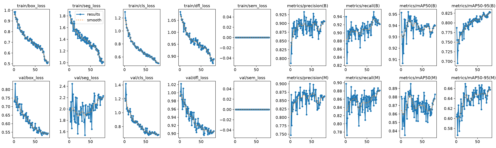
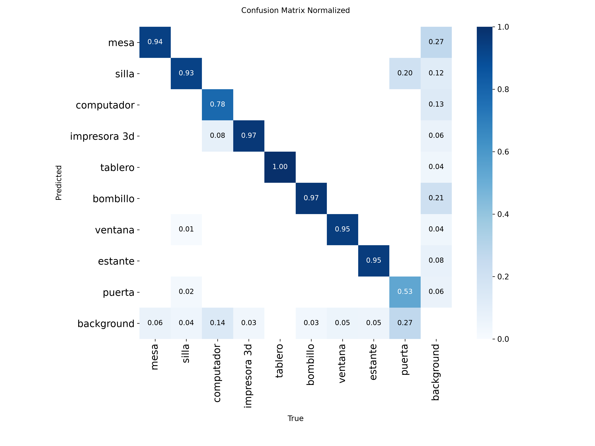
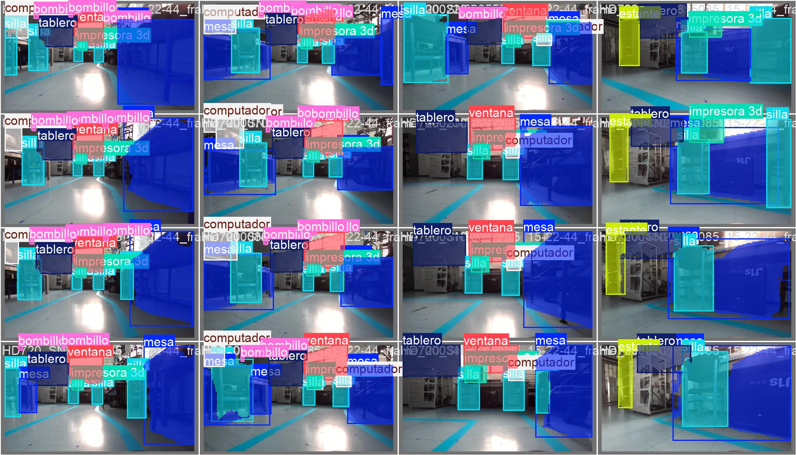

# Entrenamiento YOLO 2.0

Segunda versión del entrenamiento de segmentación de objetos capturados con una cámara ZED2. Esta carpeta conserva el código reproducible, la configuración, los modelos de despliegue y las evidencias originales de la corrida final.

## Resumen de la corrida

| Parámetro | Valor |
|---|---:|
| Arquitectura | YOLO11n-seg |
| Tarea | Segmentación de instancias |
| Clases | 9 |
| Imágenes de entrenamiento | 275 |
| Imágenes de validación | 68 |
| Épocas | 80 |
| Resolución | 640 × 640 |
| Batch | 8 |
| GPU | CUDA, dispositivo 0 |
| Duración registrada | 870,9 s (14,5 min) |

Clases: `mesa`, `silla`, `computador`, `impresora 3d`, `tablero`, `bombillo`, `ventana`, `estante` y `puerta`.

## Métricas

| Métrica | Cajas | Máscaras |
|---|---:|---:|
| Mejor mAP50-95 | **0,8287** (época 78) | **0,6695** (época 21) |
| mAP50 final | 0,9400 | 0,8832 |
| Precisión final | 0,9059 | 0,8631 |
| Recall final | 0,9214 | 0,8815 |

Los valores provienen de [`resultados/results.csv`](resultados/results.csv). El archivo `args.yaml` conserva todos los hiperparámetros de la ejecución original.





## Organización

```text
Entrenamiento_YOLO/
├── configs/                  # Clases y plantilla portable del dataset
├── modelos/
│   ├── best.pt               # Modelo Ultralytics/PyTorch
│   └── best.onnx             # Exportación para ONNX Runtime, C++ o ROS
├── resultados/               # CSV, argumentos, curvas y ejemplos
├── scripts/                  # Preparación, entrenamiento, predicción y exportación
├── requirements.txt
└── run_after_annotation.ps1
```

## Instalación

```powershell
cd Entrenamiento_YOLO
python -m venv .venv
.venv\Scripts\Activate.ps1
python -m pip install --upgrade pip
pip install -r requirements.txt
```

Para extraer imágenes directamente de archivos ZED también se requiere ZED SDK y `pyzed`. Las dependencias opcionales están separadas en `requirements-3d-optional.txt` y `requirements-annotation-optional.txt`.

## Preparación del dataset

El dataset no se incluye por tamaño. Debe respetar esta estructura:

```text
data/
├── images/
│   ├── train/
│   └── val/
└── labels/
    ├── train/
    └── val/
```

Cada etiqueta usa el formato YOLO de segmentación: `id_clase x1 y1 x2 y2 ...`, con coordenadas normalizadas. Ajusta `configs/dataset.yaml` si guardas `data/` en otra ubicación.

```powershell
python scripts/extract_frames_zed.py --help
python scripts/labelme_to_yolo_seg.py --help
python scripts/split_dataset.py --help
python scripts/update_dataset_yaml.py --help
python scripts/verify_env.py
```

## Reproducir el entrenamiento

```powershell
python scripts/train.py --model yolo11n-seg.pt --data configs/dataset.yaml --epochs 80 --imgsz 640 --batch 8 --device 0 --name zed_real_yolo11n_full
```

Los resultados se crean bajo `runs/segment/`. El entrenamiento original utilizó semilla 0, AMP, `patience=25`, 4 workers y los hiperparámetros completos de [`resultados/args.yaml`](resultados/args.yaml).

## Inferencia

```powershell
python scripts/predict.py --weights modelos/best.pt --source ruta/a/imagen_o_video
```

Consulta las opciones disponibles con `python scripts/predict.py --help`.

## Exportación y robot

```powershell
python scripts/export_model.py --weights modelos/best.pt --format onnx
```

- `best.pt`: uso directo con Python y Ultralytics; también es el modelo consumido por `Pipeline_3D`.
- `best.onnx`: alternativa portable para ONNX Runtime, C++, ROS o pipelines personalizados.
- TensorRT debe generarse en el equipo de destino porque el `.engine` depende de GPU, CUDA, TensorRT y controladores.

## Evidencias

| Etiquetas reales | Predicciones |
|---|---|
|  |  |

Las curvas PR de cajas y máscaras también se conservan en `resultados/`.
