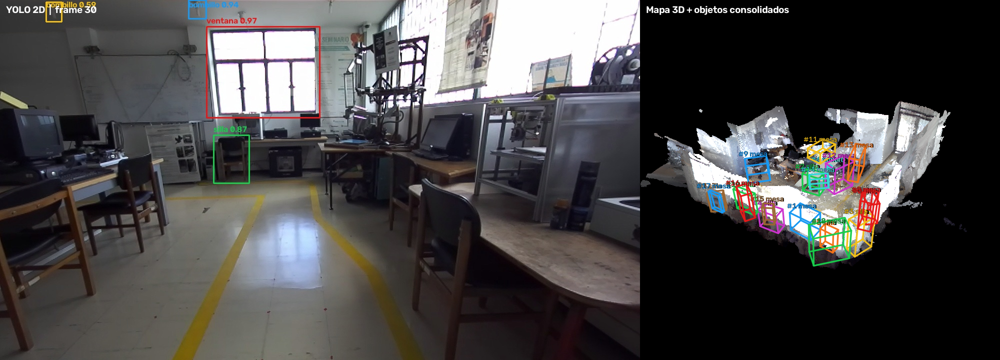
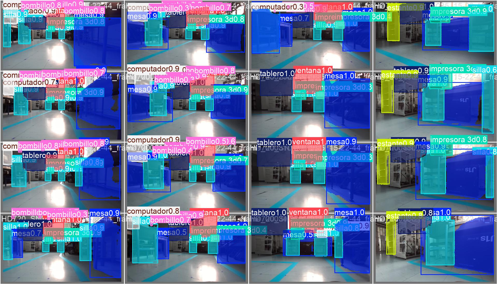
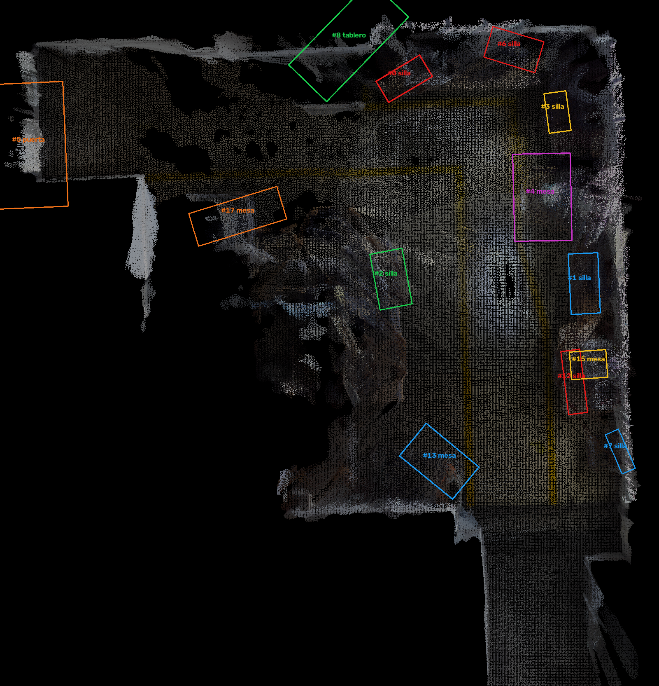
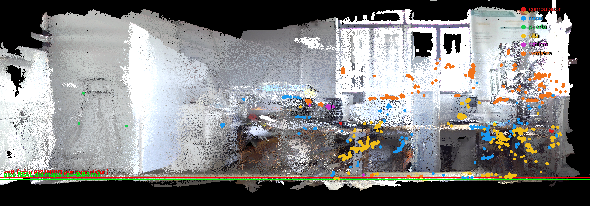
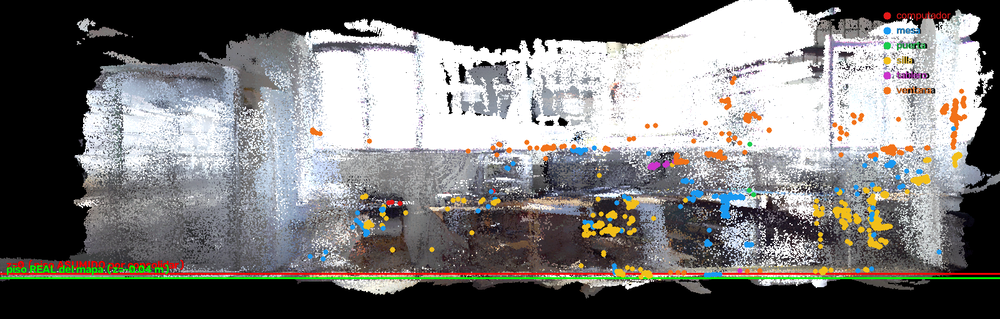
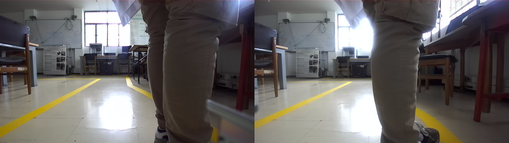

# Proyecto de Visión de Máquina 2026-1

Sistema de percepción para detectar, segmentar, localizar y medir objetos de un laboratorio con una cámara estéreo ZED2. El proyecto une un modelo YOLO11 de segmentación con profundidad, seguimiento de cámara y consolidación multivista para transformar detecciones 2D en un mapa 3D con objetos físicos identificados.

<p align="center">
  
</p>

## Autores

- Andres Camilo Torres-Cajamarca
- Juan Camilo Gomez Robayo
- Juan Andres Vallejo Rozo

## Resultado

El flujo completo procesa una grabación `.svo2`, ejecuta segmentación por instancia, recupera la geometría desde la nube de puntos y consolida observaciones repetidas del mismo objeto. En la corrida de referencia se obtuvieron **2.164 detecciones convertidas en 37 objetos físicos**: 10 sillas, 18 mesas, 3 estantes, 2 computadores, 3 tableros y 1 puerta.

| Etapa | Entrada | Salida |
|---|---|---|
| Entrenamiento | Imágenes ZED anotadas | `best.pt`, `best.onnx` y métricas |
| Inferencia 2D | Imagen RGB | Máscaras, clases y confianza |
| Geometría 3D | Máscara + profundidad | Posición, dimensiones y OBB |
| Mapeo | Nube de puntos + pose | Mapa 3D fusionado |
| Consolidación | Detecciones de múltiples frames | Inventario de objetos físicos |

## Galería

### Segmentación YOLO11



### Mapa cenital y cajas orientadas



### Alzados del modelo 3D

| Alzado X | Alzado Y |
|---|---|
|  |  |

### Captura y profundidad con ZED Explorer



## Estructura

```text
.
├── Entrenamiento_YOLO/   # Datos de la corrida 2.0, código y modelos
├── Pipeline_3D/          # Mapeo, detección 3D y consolidación
├── docs/imagenes/        # Evidencias visuales seleccionadas
├── LICENSE
└── README.md
```

## Inicio rápido

### 1. Modelo de segmentación

```powershell
cd Entrenamiento_YOLO
python -m venv .venv
.venv\Scripts\Activate.ps1
pip install -r requirements.txt
python scripts/predict.py --weights modelos/best.pt --source ruta/a/imagen_o_video
```

La reproducción del entrenamiento, la preparación del dataset y las métricas están explicadas en [Entrenamiento_YOLO/README.md](Entrenamiento_YOLO/README.md).

### 2. Pipeline ZED2 y mapa 3D

Se requiere Windows, GPU NVIDIA, ZED SDK 5.x y Python 3.10–3.12. Las instrucciones y comandos completos están en [Pipeline_3D/README.md](Pipeline_3D/README.md).

```powershell
cd Pipeline_3D
python mapeo_manual.py "ruta/a/grabacion.svo2" --depth neural_plus
python limpiar_mapa.py --brillo 0.97 --sin-visor
python deteccion_obb.py "ruta/a/grabacion.svo2" --modelo ../Entrenamiento_YOLO/modelos/best.pt --cada 3 --mundo --depth neural_plus
python consolidar_detecciones.py --sin-clases ventana --z-max 2.0 --radio 0.6 --min-det 5 --al-piso silla mesa estante
```

## Archivos deliberadamente excluidos

Las grabaciones `.svo/.svo2`, el dataset completo, nubes `.ply` grandes, entornos virtuales y salidas temporales no se versionan por tamaño y privacidad. El repositorio sí conserva código, configuraciones, modelos principales y evidencias suficientes para comprender y reproducir el trabajo con los datos originales.

## Licencia

Este repositorio se distribuye bajo los términos incluidos en [LICENSE](LICENSE).
